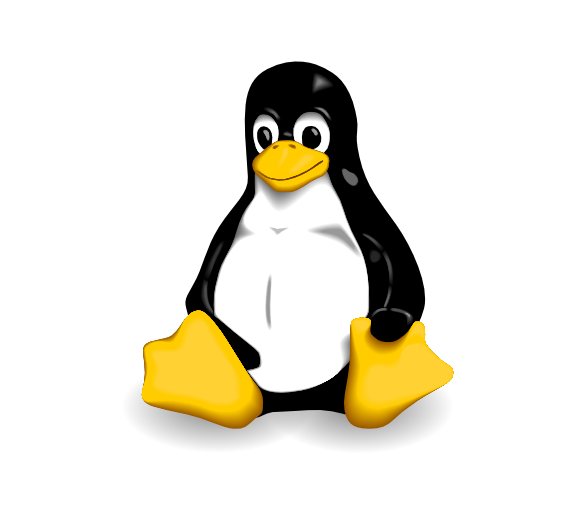

.. _Einleitung:

Einleitung
==========

.. only:: latex

    Linux ist ein freies Betriebsystem und entspricht dem Open-Source-Grundgedanken:

    * Das System und alle verfügbaren Programme sind zum einen ohne Einschränkung
      kostenlos nutzbar. 
    * Auch der Quellcode des Systems bzw. der Programme kann frei heruntergeladen
      und nach Belieben abgeändert werden.

    Dank der Sicherheit, Stabilität und Transparenz ist Linux das wohl
    beliebteste und am meisten verbreitete Betriebsystem für Großrechner, Router
    und Webserver. Mit vorkonfigurierten Varianten wie `Linux Mint
    <http://www.linuxmint.org>`_ sind auch "normale" Aufgaben wie das Benutzen
    von Office-Programmen, das Verwalten von Emails, das Abspielen von Musik-
    und Videodateien, usw. auch unter Linux komfortabel und ohne
    Programmierkenntnisse leicht umsetzbar. 
    
    Linux bietet allerdings -- im Gegensatz zu kommerziellen Systemen -- stets
    die Möglichkeit, die Funktionsweise des Betriebsystems und seiner Programme
    auch genauer zu verstehen. Auch können mittels einfacher Shell-Skripte
    Aufgaben häufig auch automatisiert gelöst werden.

.. only:: html

    Ohne gute Werkzeuge und ein hilfsbereites Team macht jede Arbeit nur halb so
    viel Spaß. An dieser Stelle möchte ich daher kurz festhalten, welche Prinzipien
    und technischen Eigenschaften mich von Linux und dem Open-Source-Gedanken
    überzeugt haben und welche Anwendungen und Skripte mir seitdem in vielen
    Situationen weiter geholfen haben.

.. _Grundgedanken von Open Source:

.. rubric:: Grundgedanken von Open Source

Open Source kann als ein gemeinschaftliches Prinzip der Zusammenarbeit
verstanden werden -- es ist daher auch nicht an ein spezielles Betriebsystem
gebunden. Zahlreiche Programme, beispielsweise `Firefox
<http://de.wikipedia.org/wiki/Firefox>`_, `Thunderbird
<http://de.wikipedia.org/wiki/Thunderbird>`_, `Open Office
<https://de.wikipedia.org/wiki/OpenOffice>`_, `VLC
<http://de.wikipedia.org/wiki/VLC_media_player>`_, `Gimp
<http://de.wikipedia.org/wiki/Gimp>`_ , und `Inkscape
<http://de.wikipedia.org/wiki/Inkscape>`_, sind inzwischen auf vielen
Betriebsystemen weit verbreitet. [#H1]_ Am bekanntesten wurde die
Open-Source-Mentalität allerdings durch `Linux
<http://de.wikipedia.org/wiki/Linux>`_, welches vollständig auf freier Software
aufbaut.

Jeder darf sich freie Software und Betriebsysteme kostenlos herunterladen,
benutzen und modifizieren. Eine Übersicht über zahlreiche Open-Source-Programme
bietet -- unabhängig vom Betriebsystem -- beispielsweise `Sourceforge
<http://sourceforge.net>`_. Eine Übersicht über Linux-Software bietet
beispielsweise das `Ubuntuusers-Wiki <http://wiki.ubuntuusers.de/Software>`_.

.. index:: Copyleft
.. _Die Geschichtliche Entwicklung von Open Source und Linux:

.. rubric:: Die Geschichtliche Entwicklung von Open Source und Linux

Die Open-Source-Bewegung entstand, als einige Software-Firmen damit begannen,
ihren Kunden Software nicht mehr in Form von Quellcode, sondern als bereits in
Maschinencode umgewandelte Programme zu verkaufen. Diese waren zwar für
Computer, jedoch nicht mehr für Menschen lesbar.

.. only:: latex

    .. image:: pics/open-source.png
        :align: center
        :width: 40%

Etliche Programmierer befürchteten dabei vor allem einen Kontrollverlust auf
Seiten der Kunden und kritisierten den mangelnden Informationsfluss seitens der
Software-Hersteller. Darüber hinaus wurde -- in Kombination mit der Patentierung
von "geistigem Eigentum" -- die Gleichberechtigung der Programmierer als
gefährdet angesehen. Das Know-How, so fürchtete man, würde sich schnell nur auf
wenige Firmen konzentrieren. 

Um nun derartigen Patentierungen von Informationen und den daraus resultierenden
technischen und rechtlichen Problemen entgegenzuwirken, wurden unter anderem die
"Open-Source"-Bewegung und die "Free Software Foundation" ins Leben gerufen und
mit der Entwicklung gemeinschaftlicher, frei verfügbarer Software begonnen. 

.. only:: html

    .. figure:: pics/open-source.png
        :name: fig-open-source-logo
        :alt:  fig-open-source-logo
        :align: center
        :width: 40%

        Das `Open-Source-Logo <http://de.wikipedia.org/wiki/Open_source>`_. 
      
        :download:`SVG: Open-Source-Logo <pics/open-source.svg>`

.. index:: GNU

In den 1970er und 1980er Jahren entstand so das zahlreiche freie Software
umfassende `GNU-Projekt <http://de.wikipedia.org/wiki/GNU>`_, das sogar eine
eigene Lizenz-Regelung (`GNU General Public License (GPL)
<http://de.wikipedia.org/wiki/Gpl>`_) mit sich brachte. Die Grundgedanken, die
Quellcode-Bibliotheken sowie die rechtlichen Grundlagen stellten letztlich in
den 1990er Jahren die Basis für das neue Betriebsystem "Linux" dar. [#AQ]_

    Das `Linux-Maskottchen Tux <http://de.wikipedia.org/wiki/Tux_(Maskottchen)>`_. 
    
    .. only:: html
    
        :download:`SVG: Tux <pics/tux.svg>`

.. _Nutzen, Verstehen, Mitmachen:

.. rubric:: Nutzen, Verstehen, Mitmachen! 

Die Linux- und Open-Source-Gemeinschaft lädt nicht nur dazu ein, eine Vielzahl
an frei verfügbaren Programmen kostenlos herunterzuladen und zu nutzen -- sie
ist gleichzeitig darum bemüht, den Nutzern die Vorteile von
Open-Source-Projekten sowie die Funktionsweise von Software verständlich zu
machen. In einem Team, in dem ein jeder von der Arbeit aller anderen profitiert,
sind weitere "Kollegen" schließlich jederzeit willkommen.. :-) 

Mit Linux als Betriebsystem hat jeder Nutzer die Möglichkeit, sich den Quellcode
von anderen Programmierern anzuschauen und -- durch Lesen und eigenes
Code-Schreiben -- auch selbst ein Software-Entwickler zu werden. 

Doch nicht nur Quellcode ist von Bedeutung: Alle Informationen, die unter einer
gemeinnützigen Lizenz wie der `Creative-Commons-License (CCL)
<http://de.wikipedia.org/wiki/Creative_Commons>`_ oder der `General Public
License (GPL) <http://de.wikipedia.org/wiki/Gpl>`_ veröffentlicht werden, tragen
zum frei abrufbaren Wissensschatz und somit zum Gemeinwohl der Gesellschaft bei! 

.. raw:: html

    

    
.. only:: html

    .. rubric:: Anmerkungen:

.. [#H1] Geschichtlich interessant zum Verständnis von Open Source und Linux ist
    auch der Essay `"Die Kathedrale und der Basar"
    <https://de.wikipedia.org/wiki/Die_Kathedrale_und_der_Basar>`_ von `Eric
    Raymond <http://de.wikipedia.org/wiki/Eric_Raymond>`_, der letztlich zu
    einer quellfreien Veröffentlichung des "Netscape Navigator" -- dem Vorläufer
    von Mozilla Firefox -- und zu einem Umdenken in der Industrie geführt hat.

.. [#AQ] Die wohl wichtigsten Prinzipien sind in einem `Aufsatz von Chistian
    Imhorst <http://texte.datenteiler.de/anarchie-und-quellcode-2>`_
    zusammengefasst:

    .. pull-quote::

        Der Programmierer freier Software verschenkt mit der GPL die Kontrolle über
        sein Werk, nicht aber das Werk als solches. Er behält die Autorenschaft über
        sein Programm. Dem Benutzer der Software wiederum werden bestimmte
        Freiheiten gewährt, wie die Freiheit das Werk zu modifizieren und verändert
        zu veröffentlichen. An diese Freiheit ist nur eine Bedingung geknüpft: Das
        veränderte Werk muss wieder unter der GPL stehen. (...) Freie Software soll
        nicht Eigentum eines Einzelnen, sondern das Eigentum von allen sein.

        (...)

        Niemand ist vom Eigentum an GPL-Software ausgeschlossen. Ihre Verbreitung
        kann deshalb von niemandem kontrolliert werden. Wer sie haben möchte, kann
        sie einfach kopieren und weitergeben, wodurch die Verfügbarkeit von
        GPL-Software sehr schnell wächst. Die GPL verhindert zwar, dass Menschen
        von dem Gebrauch freier Software ausgeschlossen werden, aber sie schließt
        auf der anderen Seite ebenfalls aus, dass jemand aus freier Software
        proprietäre macht. Niemand kann daran gehindert werden, das freie
        Betriebssystem GNU/Linux zu benutzen, und niemandem kann es weggenommen
        werden. Jeder, der GNU/Linux aus dem Internet herunter lädt, auf seinen
        Rechner installiert, Kopien davon verschenkt oder verkauft, dem gehört es
        auch. 
      
        In diesem Sinne ist die GPL eher eine Anti-Lizenz, weshalb `Richard Stallman
        <http://de.wikipedia.org/wiki/Richard_Stallman>`_ von ihr auch lieber als
        `Copyleft <http://de.wikipedia.org/wiki/Copyleft>`_ spricht anstatt von
        einem Copyright.

        -- Christian Imhorst

    Quellcode sollte nach dieser Ethik geteilt, d.h. ohne Hindernisse
    ausgetauscht und für jeden frei zugänglich gemacht werden. So wurden
    ähnliche Lizenzen auch für Bücher und Musik geschaffen. Das berühmteste
    Beispiel ist `Wikipedia <http://de.wikipedia.org>`_. 

